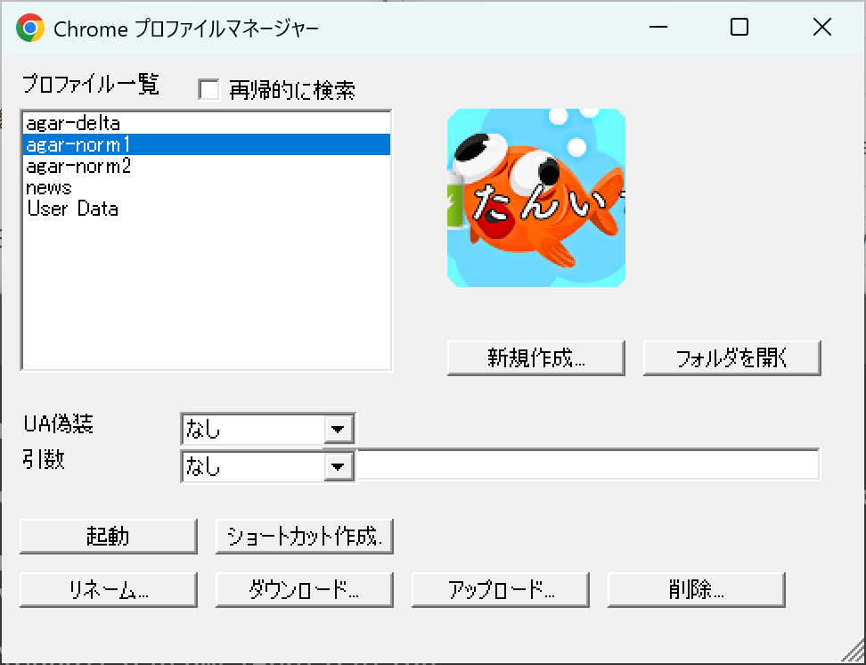
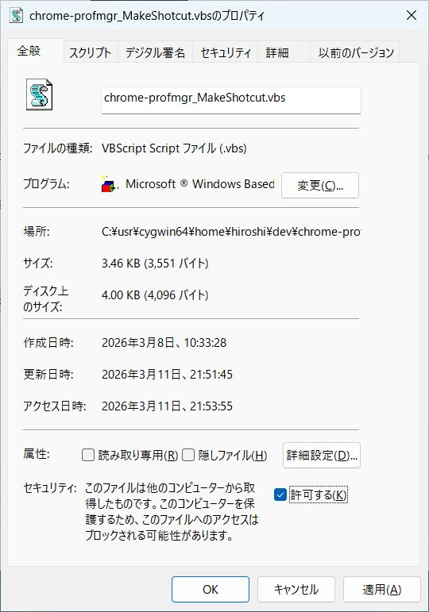

# chrome-profmgr

&nbsp;&nbsp;&nbsp;&nbsp;Google Chrome 用のプロファイルマネージャーです。

  

&nbsp;&nbsp;&nbsp;&nbsp;要するに Firefox における `firefox -P` のようなものが欲しいと思って作りました。

&nbsp;&nbsp;&nbsp;&nbsp;VbScript 版の時に要望のあったダウンロード(プロファイルを別の PC に引っ越し) の機能も追加しました。

&nbsp;&nbsp;&nbsp;&nbsp;一応、多言語化に対応しています。ただし独自仕様です。

## インストール
&nbsp;&nbsp;&nbsp;&nbsp;[chrome-profmgr_20260311-1.zip](https://github.com/tannichi1/chrome-profmgr/releases/download/v1.0.0/chrome-profmgr_20260311-1.zip)

&nbsp;&nbsp;&nbsp;&nbsp;**ローカルディスク**上に適当なフォルダを作成して zip ファイルの中身を展開してください。

&nbsp;&nbsp;&nbsp;&nbsp;プログラムの起動は単に付属の `.ps1` ファイルを実行すれば良いのですが、既定で `.ps1` ファイルはダブルクリックでは起動せず、起動が面倒なので起動用ショートカットを作成するスクリプトを作成しました。

&nbsp;&nbsp;&nbsp;&nbsp;窓付き用(`xxx_MakeShotcut.vbs`)、窓無し用(`xxx_MakeShotcut-Hidden.vbs`)、窓無し＋PowerShell 7 で実行用(`xx_MakeShotcut-Hidden-v7.vbs`) がありますので、どれかを実行するとデスクトップにショートカットを作成します。
このスクリプトは汎用に作られていて、任意の `.ps1` ファイル(複数可) を `.vbs` ファイルに Drag&Dtop すると対応するショートカットが作成されます。

&nbsp;&nbsp;&nbsp;&nbsp;もし、 `.vbs` ファイルの実行時に以下のエラーメッセージが出るようであれば、 `.vbs` ファイルのプロパティーを開いて、タブ「全般」の項目セキュリティーを「■許可する」にチェックを入れてください。

  

  

## バグ

- ダウンロード時フリースしたように見える
   - プロファイルのダウンロード(zip ファイルの作成) 処理は時間がかかるのに、プログレスバーも出ないし、マウスも砂時計に変わりにくいので、フリーズしたように見えます。

- アイコンが 16 色になってしまう
  - Google にログインしているプロファイルであれば、アイコンイメージ(PNG形式) を取得できるのですが、うまく ICO イメージに変換できません。

  - 隠しパラメーター `config.link_with_icon=true` にするとショートカット作成時にアイコンを設定しますが、16色に減色してしまいます。

- 翻訳が適当
  - Google 翻訳が悪い。・・・という事にしておいてください。

## 背景
&nbsp;&nbsp;&nbsp;&nbsp;実は、今はオワコンになった某ブログで VbScript(VBS) 版を公開していたのですが、使えなくなったので、PowerScript 版を新しく作成しました。

&nbsp;&nbsp;&nbsp;&nbsp;VbScript 版が使えなくなった理由を簡単に言うと、画面操作(UI) を担当していた、Internet Explorer(IE) が提供されなくなったのが原因です。
代わりに Microwsoft Edge が使えないか思ったのですが、Edge は(追加ツールをインストールしない限り) COM インターフェースを提供しないので、VbScript から操作できなかったのです。(あまり簡単じゃなかったか？)

&nbsp;&nbsp;&nbsp;&nbsp;VbScript は COM オブジェクトは使えますが、.NET オブジェクトは扱えません。一方、PowerScript は .NET と COM オブジェクトの両方を使えます。

&nbsp;&nbsp;&nbsp;&nbsp;しかし、VbScript 自体も廃止の予定があるとか。プロファイルマネージャー自体の機能として、ショートカットの作成に VbScript を内部的に使用しているので、VbScript が廃止されるとこのプログラム自体も動作不能になります。

