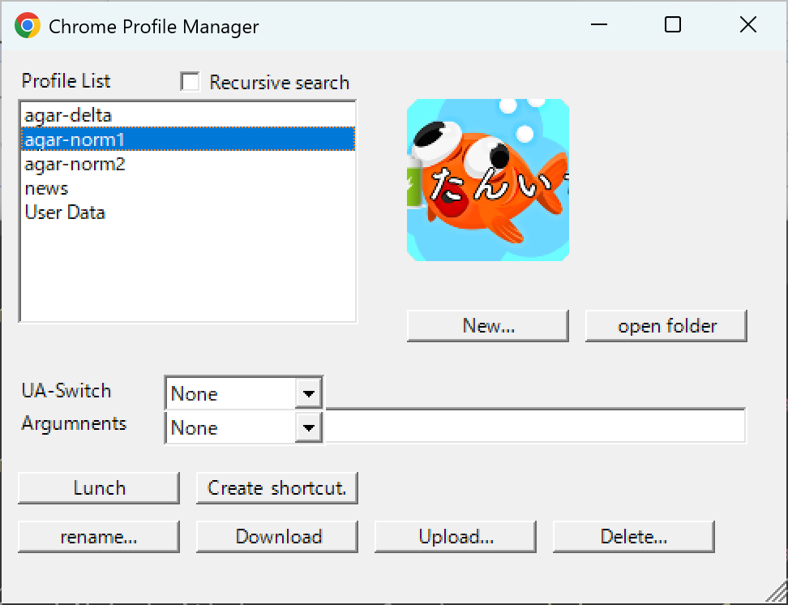

# chrome-profmgr

&nbsp;&nbsp;&nbsp;&nbsp;Profile Manager for Google Chrome

# DESCRIPTION

&nbsp;&nbsp;&nbsp;&nbsp;A profile manager for Google Chrome.

  

&nbsp;&nbsp;&nbsp;&nbsp;In short, I created it because I wanted something similar to `firefox -P` for Firefox.

&nbsp;&nbsp;&nbsp;&nbsp;It does support multiple languages, but it is a proprietary specification.

# INSTRATION
&nbsp;&nbsp;&nbsp;&nbsp;To start the program, simply run the included `.ps1` file, but by default, `.ps1` files do not start when double-clicked, which can be a hassle, so I created a script to create a shortcut for starting the program.

&nbsp;&nbsp;&nbsp;&nbsp;There are versions available for a windowed version (`xxx_MakeShotcut.vbs`), a windowless version (`xxx_MakeShotcut-Hidden.vbs`), and a windowless version running with PowerShell 7 (`xx_MakeShotcut-Hidden-v7.vbs`). Running any of these will create a shortcut on your desktop.

&nbsp;&nbsp;&nbsp;&nbsp;This script is general-purpose, and if you drag and drop any `.ps1` file(s) onto a `.vbs` file, a corresponding shortcut will be created.

# BUG

- It appears to freeze when downloaded.
  - The profile download (zip file creation) process takes a long time, but no progress bar appears and the mouse pointer does not change to an hourglass, so it appears frozen.

- Icons are displayed in 16 colors
  - If you are logged in to Google with a profile, you can obtain the icon image (PNG format), but you cannot convert it to an ICO image.

  - If you set the hidden parameter `config.link_with_icon=true`, an icon will be set when you create a shortcut, but the number of colors will be reduced to 16.

- Translation is appropriate
  - Let's just say that Google Translate is bad.

