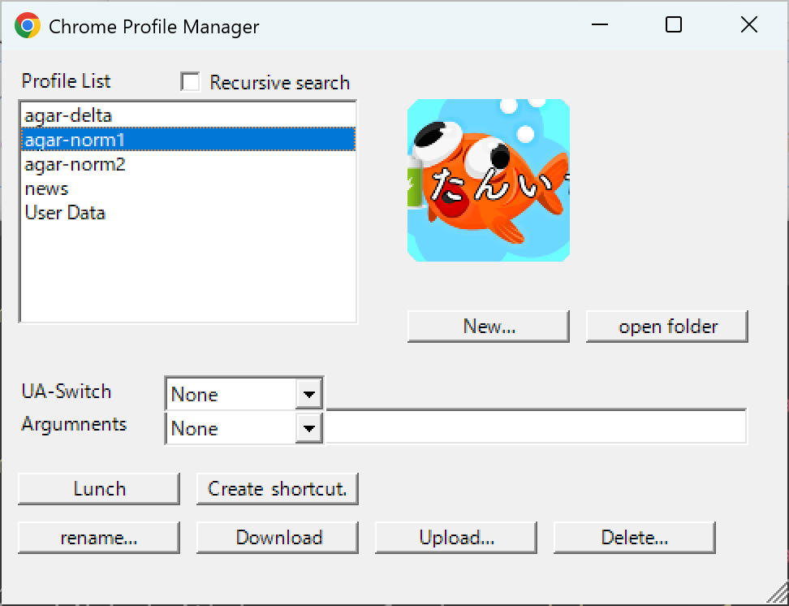
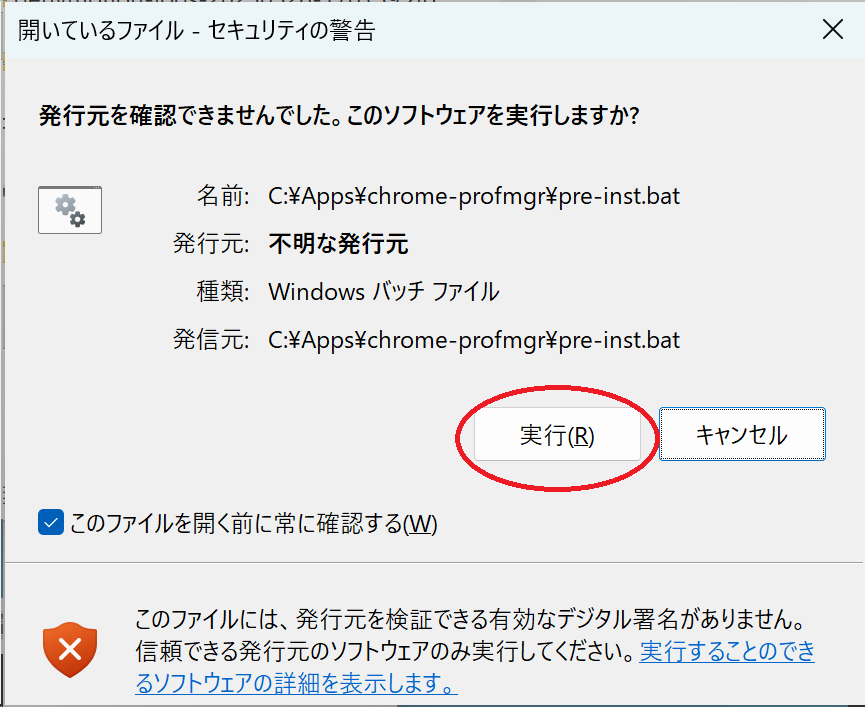

# chrome-profmgr

&nbsp;&nbsp;&nbsp;&nbsp;A profile(UserData) manager for Google Chrome.

<div align="center">
  
</div>


&nbsp;&nbsp;&nbsp;&nbsp;In short, I created it because I wanted something similar to `firefox -P` for Firefox.

&nbsp;&nbsp;&nbsp;&nbsp;It does support multiple languages, but it is a proprietary specification.

# INSTRATION
&nbsp;&nbsp;&nbsp;&nbsp;[chrome-profmgr_20260312-2.zip](https://github.com/tannichi1/chrome-profmgr/releases/download/v1.0.0/chrome-profmgr_20260312-2.zip)

&nbsp;&nbsp;&nbsp;&nbsp;Create a suitable folder on your **local disk** and extract the contents of the zip file into it.

> [!NOTE]  
> &nbsp;&nbsp;&nbsp;&nbsp;Using an external tool to extract zip files can save you trouble later on.  
> &nbsp;&nbsp;&nbsp;&nbsp;In this example, we will explain the process assuming the files are extracted to `C:\Apps\chrome-profmgr\`.  

&nbsp;&nbsp;&nbsp;&nbsp;Run `pre-inst.bat` located in the extracted folder.  
&nbsp;&nbsp;&nbsp;&nbsp;If a security warning appears at this point, click [Run (R)]. If you don't want to ignore the warning, do the following:  
&nbsp;&nbsp;&nbsp;&nbsp;Press `Windows key + R` to launch `cmd`, and then do the following:  
```
C:\Users\tannichi1>cd C:\Apps\chrome-profmgr
C:\Apps\chrome-profmgr>type pre-inst.bat > pre-inst.cmd
C:\Apps\chrome-profmgr>.\pre-inst.cmd
```

<div align="center">
  
</div>

&nbsp;&nbsp;&nbsp;&nbsp;To launch the program, you simply need to run the included `.ps1` file, but by default, `.ps1` files don't launch with a double-click, which is inconvenient. So, I created a script to create a shortcut for launching the program.  

&nbsp;&nbsp;&nbsp;&nbsp;Please perform one of the following actions.
* `xxx_MakeShotcut.vbs` - with window  
* `xxx_MakeShotcut-Hidden.vbs` - no window  
* `xx_MakeShotcut-Hidden-v7.vbs` - Run without a window + PowerShell 7  

&nbsp;&nbsp;&nbsp;&nbsp;These scripts are designed for general use; dragging and dropping any `.ps1` file(s) into a `.vbs` file will create a corresponding shortcut.  

# BUG

- It appears to freeze when downloaded.
  - The profile download (zip file creation) process takes a long time, but no progress bar appears and the mouse pointer does not change to an hourglass, so it appears frozen.

- Icons are displayed in 16 colors
  - If you are logged in to Google with a profile, you can obtain the icon image (PNG format), but you cannot convert it to an ICO image.

  - If you set the hidden parameter `config.link_with_icon=true`, an icon will be set when you create a shortcut, but the number of colors will be reduced to 16.


- Translation is appropriate
  - Let's just say that Google Translate is bad.


